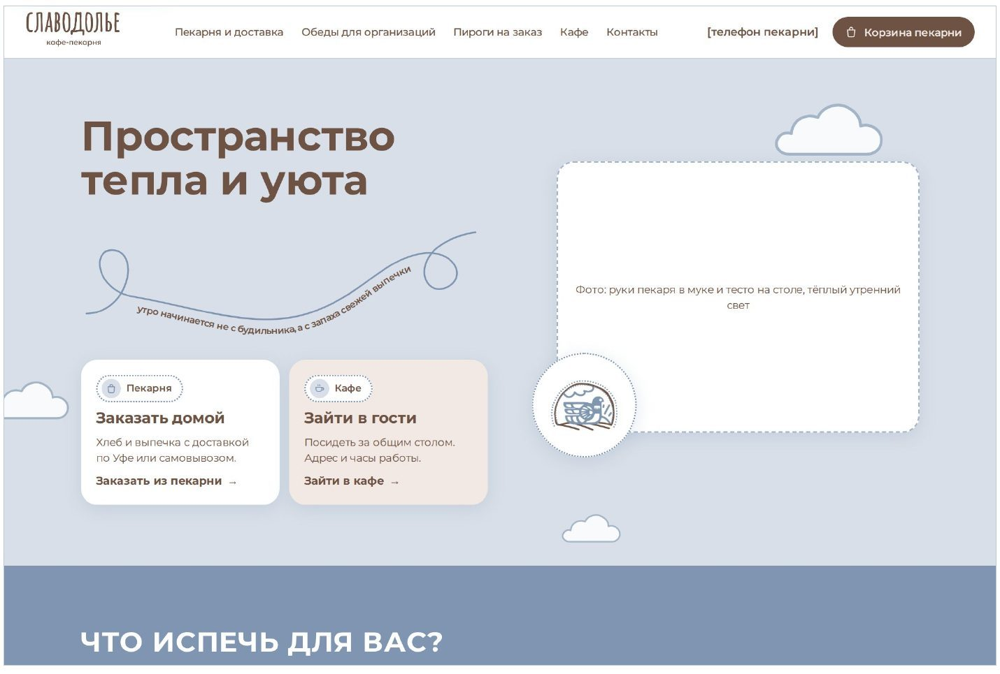
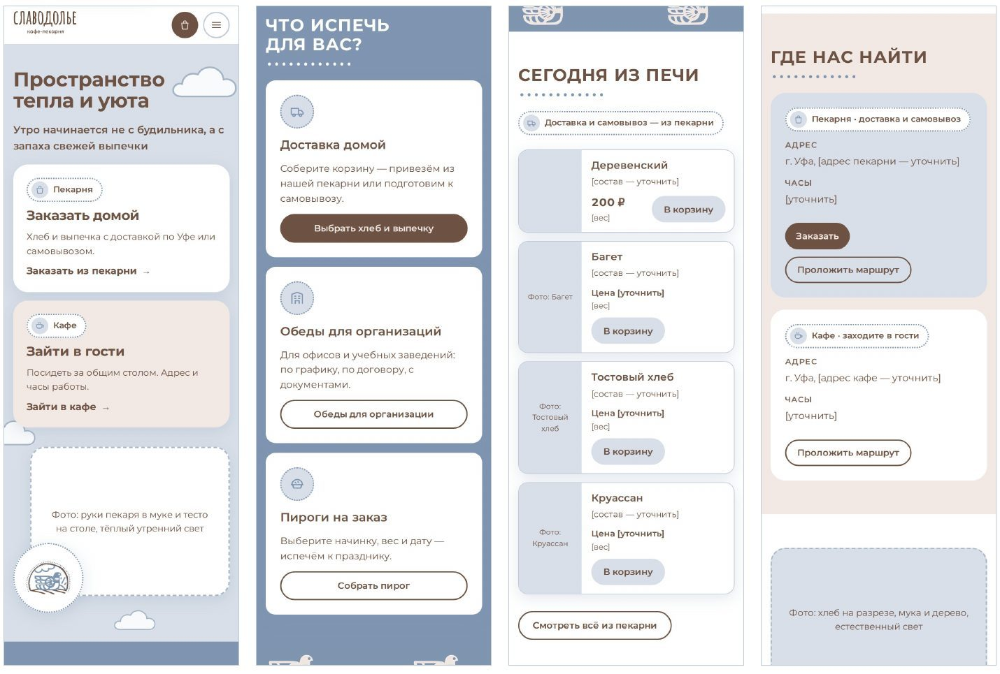
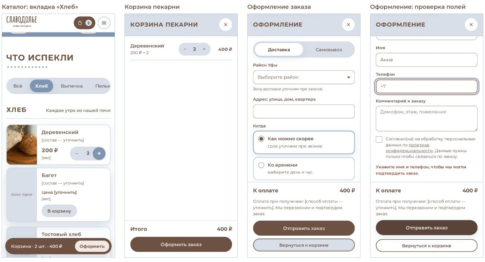
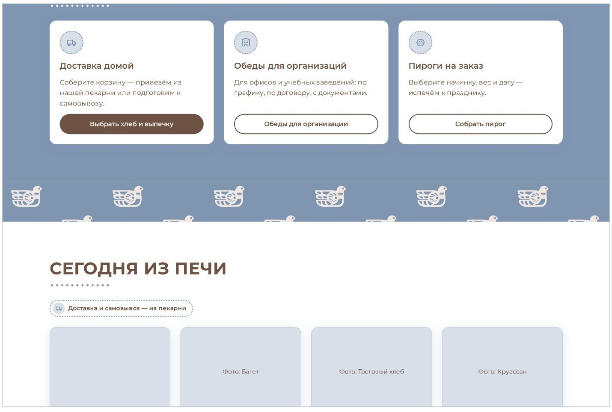
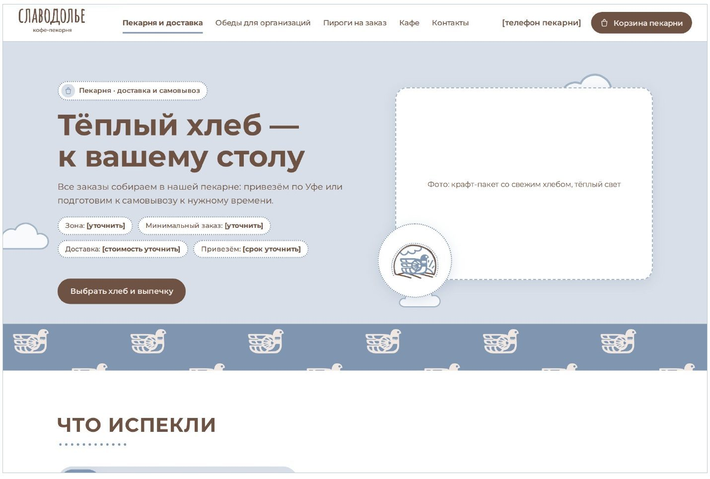
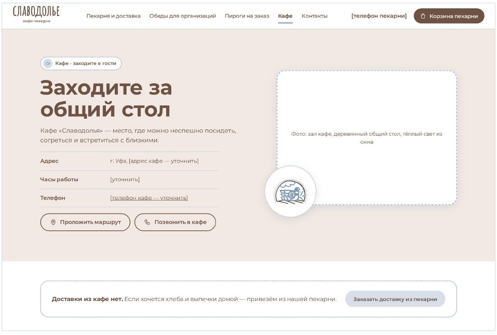
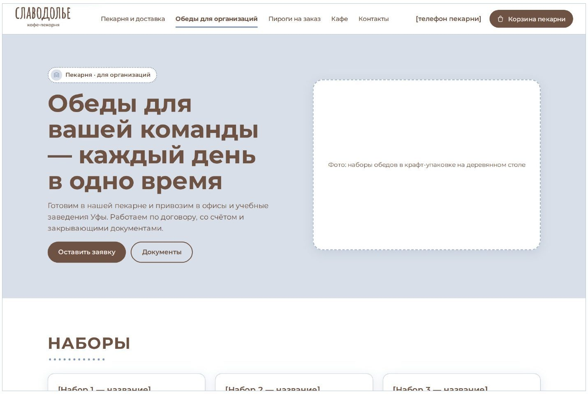
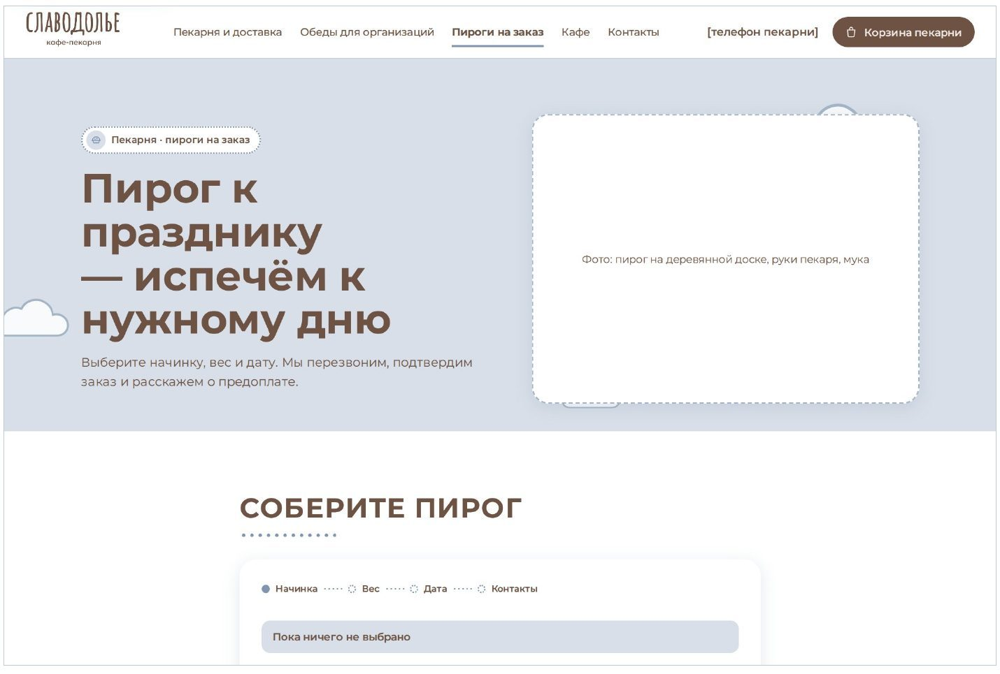
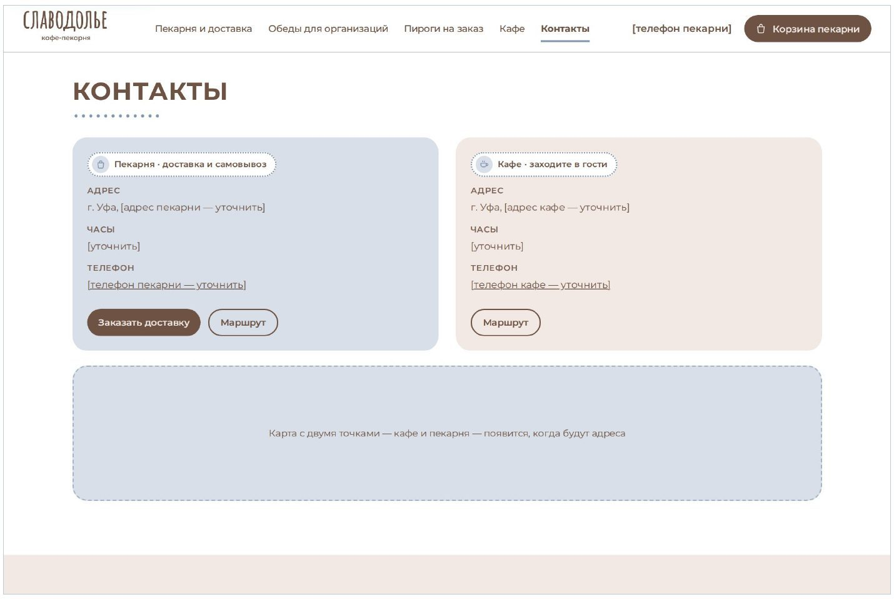
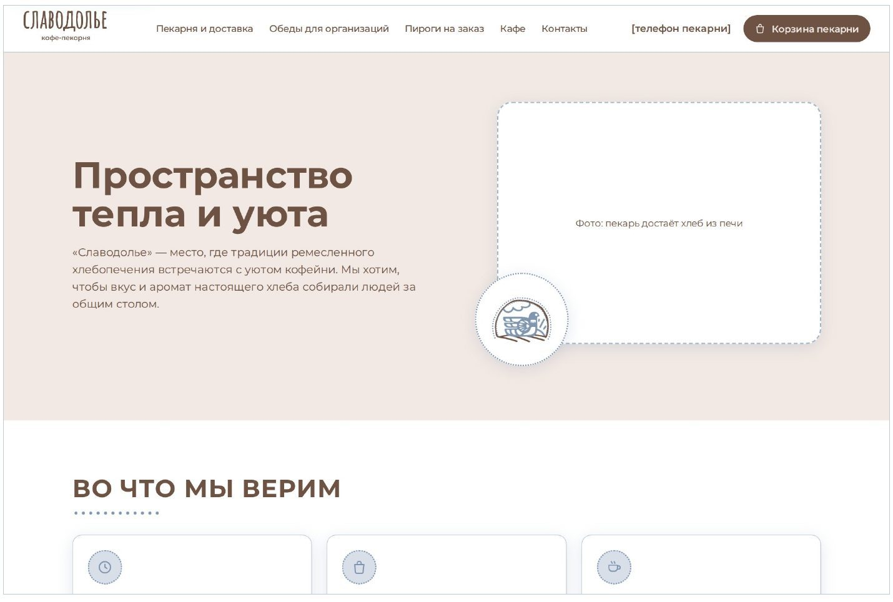

# «Славодолье» — сайт и контент для кафе-пекарни в Уфе

Портфолио-проект: сайт на HTML/CSS/JavaScript, контент-планы для соцсетей, сезонные активности и исследование рынка для кафе-пекарни «Славодолье» (Уфа, сентябрь–октябрь 2026).

**Автор:** [Докучаев Михаил Сергеевич] · [контакт: @Mr_ipadkid / d0kuchaev.miha@gmail.com]

**Живая версия сайта:** (https://github.com/d0kuchaevmiha-arch/slavodolie-portfolio/blob/main/site/index.html)

---

## Что сделано

| Направление | Результат | Где смотреть |
|---|---|---|
| Сайт | 8 страниц, корзина пекарни, три формы заказа, адаптив под телефон, фирменный стиль из логобука | [`site/`](site/) |
| Контент для соцсетей | 2 недельных контент-плана: 14 постов в двух вариантах текста, идеи фото, хэштеги, 6 сценариев Reels и историй | [`content/`](content/) |
| Сезонный маркетинг | 5 идей событий и позиций на октябрь (коллаборации с пасечником и ремесленниками, мастер-класс, сезонная линия) | [`content/seasonal-ideas-2026-10.md`](content/seasonal-ideas-2026-10.md) |
| Исследование | Тренд-обзор на 8 страниц: рынок пекарен, сезон октябрь–ноябрь, конкуренты в Уфе, с источниками | [`research/trend-review-2026-09.pdf`](research/trend-review-2026-09.pdf) |
| Бренд | Правила тона голоса и визуального стиля, по которым сделано всё остальное | [`content/brand-voice.md`](content/brand-voice.md) |

## Сайт

Статический сайт, работает без сервера и сборки: достаточно открыть `site/index.html`.

**Страницы:** главная, пекарня и доставка, кафе, обеды для организаций, пироги на заказ, контакты, о нас, политика конфиденциальности.

**Что умеет:**

- корзина пекарни сохраняется между страницами и после перезагрузки;
- оформление заказа: доставка или самовывоз, выбор района Уфы, «как можно скорее» или ко времени, проверка полей с понятными подсказками;
- конструктор пирога на заказ: начинка → вес → дата → заявка;
- заявка на обеды для организаций;
- все данные заведения (адреса, телефоны, часы, условия доставки, меню) вынесены в два файла — `config.js` и `menu.js`. Владелец меняет их в Блокноте, без правки вёрстки;
- пока данных нет, сайт честно показывает `[уточнить]` вместо выдуманных цен и адресов.

**Технологии:** HTML5, CSS3 (переменные, сетки, адаптивная вёрстка), чистый JavaScript без библиотек, `localStorage` для корзины, изображения WebP с запасным JPG.

| Телефон | Корзина и оформление заказа |
|---|---|
|  |  |

Остальные страницы

## Контент

- [Контент-план 28.09–04.10.2026](content/content-plan-2026-09-28.md) — золотая осень, День пожилых людей, смысл тетерева на логотипе.
- [Контент-план 05.10–11.10.2026](content/content-plan-2026-10-05.md) — дождливый октябрь, День учителя, ярмарка ремесленников, День Республики Башкортостан.
- [Идеи сезонных активностей — октябрь 2026](content/seasonal-ideas-2026-10.md).

Каждый пост — в двух вариантах с разным настроением, с идеей фото по фотостилю бренда. Планы учитывают погоду в Уфе и календарь праздников недели.

## Как я работал

1. Собрал бренд-платформу из логобука: смыслы, тон голоса, цвета, шрифт, фирменные элементы ([brand-voice.md](content/brand-voice.md)).
2. Провёл исследование рынка и конкурентов, из него выросли идеи для сайта и соцсетей.
3. Сделал макет сайта, затем первую одностраничную версию, затем текущую многостраничную с отдельными сценариями для пекарни, кафе, обедов и пирогов.
4. Еженедельно готовил контент-планы с учётом погоды и инфоповодов.

**Инструменты:** [проверьте и поправьте под себя] Claude (ИИ-ассистент: черновики текстов, исследование, помощь с кодом), Claude Design (макет), VS Code, Git и GitHub.

## Что пока не готово

- Заявки с сайта не отправляются: место для подключения — функция `sendRequest` в `site/script.js` (например, Telegram-бот или почта).
- Нет реальных адресов, телефонов, цен и фото — ждут данных от заведения.
- Перевод вывески и табличек на башкирский язык.
- Цены на скриншотах корзины демонстрационные.

---

Бренд «Славодолье», логотип и фирменный стиль принадлежат заведению. Материалы опубликованы как пример работы.
